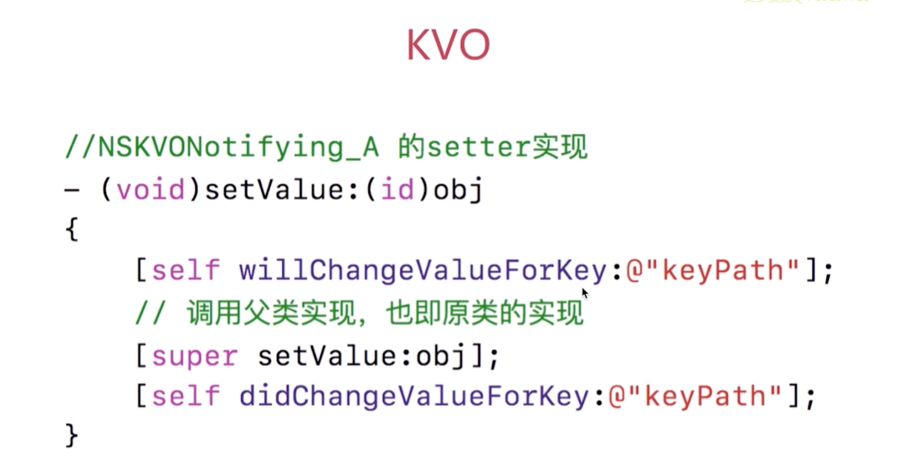
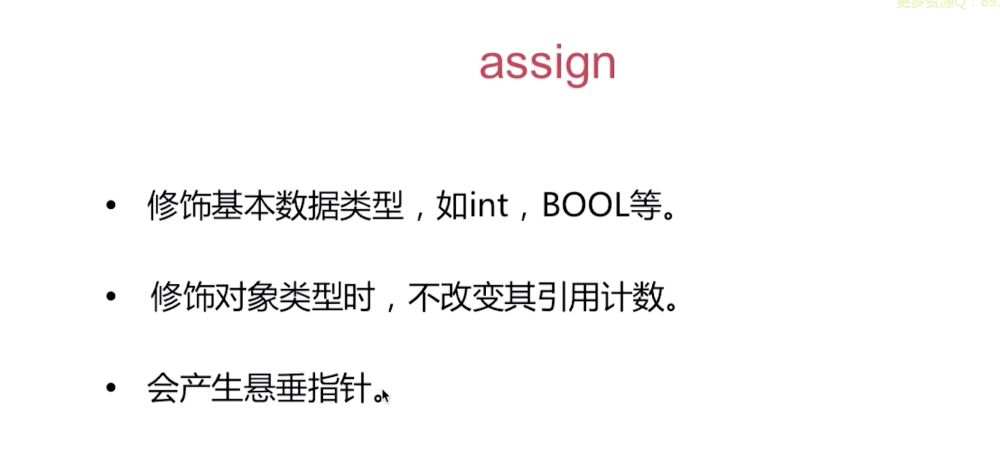

# Objective-C 语言特性相关面试问题

## 你用分类都做了哪些事？
1. 声明私有方法
2. 分解体积庞大的类文件
3. 把Framework的私有方法公开化
4. 等其他一些用法
## 分类的特点
1. 运行时决议: 实际在编写好分类文件后，并没及时讲分类文件中添加的内容附加到相应的宿主类上，而是在运行时，通过Runtime 将分类中的内容真实添加到宿主类上去
2. 可以为系统类添加分类
## 分类中都可以添加哪些内容
1. 实例方法
2. 类方法
3. 协议
4. 属性(实际只是声明对应的setter/getter方法，并没有生成相应的实例变量)，注意要添加实例变量，要用到关联对象的技术点添加.


在程序启动之后，在运行时会调用_objc_init方法，其实就是runtime的初始化
* 分类的加载调用栈
 


分类的特点:


## 关联对象
##### 关联对象的常用方法 -- 给分类添加"成员变量"
```
// 取出关联对象的志
id objc_getAssociatedObject(id object, const void * key)
// 设置关连对象
void objc_setAssociatedObject(id object, const void * key,
                         id value, objc_AssociationPolicy policy)

// 移除所有的关联对象
void objc_removeAssociatedObjects(id object)
```
##### 关联对象的本质
关联对象是由AssociationsManager管理并在AssociationsHashMap 中存储.
所有对象的关联内容都在同一个全局容器中。


## 扩展(Extension)
##### 扩展一般用来做什么？
* 声明私有属性
* 声明私有方法
* 声明私有成员变量

##### 扩展的特定
* 编译时决定
* 只以声明的形式存在，多数情况下寄生于宿主类的.m中
* 不能为系统类添加扩展

## 代理
注意循环引用即可 及与通知的区别
## 通知
如何实现通知机制?(让自己手动实现通知中心)


## KVO
kVO: key-value-observing 的缩写
KVO是Objectve-C 对观察者模式的又一实现
Apple 使用了isa混写(isa_swizzing)来实现KVO
##### KVO实现原理


当我们注册一个对象A的观察者的时候,实际上是调用了系统的:
`- (void)addObserver:(NSObject *)observer forKeyPath:(NSString *)keyPath options:(NSKeyValueObservingOptions)options context:(nullable void *)context`方法，此时系统会在运行时动态为我们创建一个NSKVONotifying_A 的子类,并且会将原类A的isa指针指向NSKVONotifying_A这个新创建的类(isa的混写),并且重写被观察属性的setter方法，来达到可以通知所有观察者对象的目的。

重写setter方法的实现：

 
 
** KVO触发条件:**
 1. 使用setter方法改变值会生效
 2. 使用setValue:forKey改变值也会生效
 3. 成员变量直接修改不会生效，需要手动触发KVO 才能生效
```
- (void)willChangeValueForKey:(NSString *)key;
- setAValue;
- (void)didChangeValueForKey:(NSString *)key
```

## KVC
KVC: key-value-coding 的缩写
```
+ (nullable id)valueForKey:(NSString *)key;
+ (void)setValue:(nullable id)anObject forKey:(NSString *)key
```
`valueForKey:`的查找过程如下:


## 属性关键字



 
 
