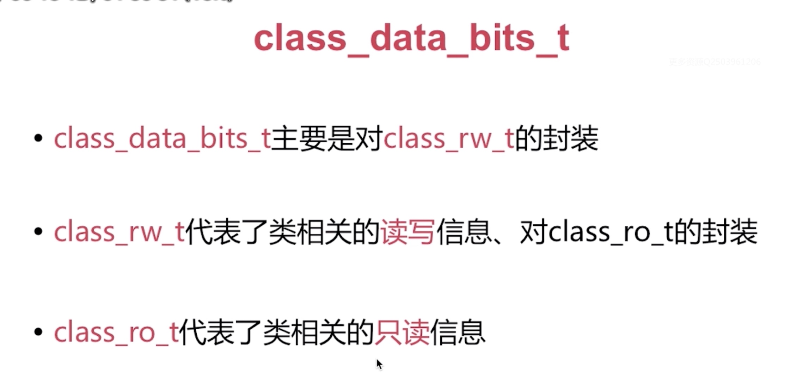
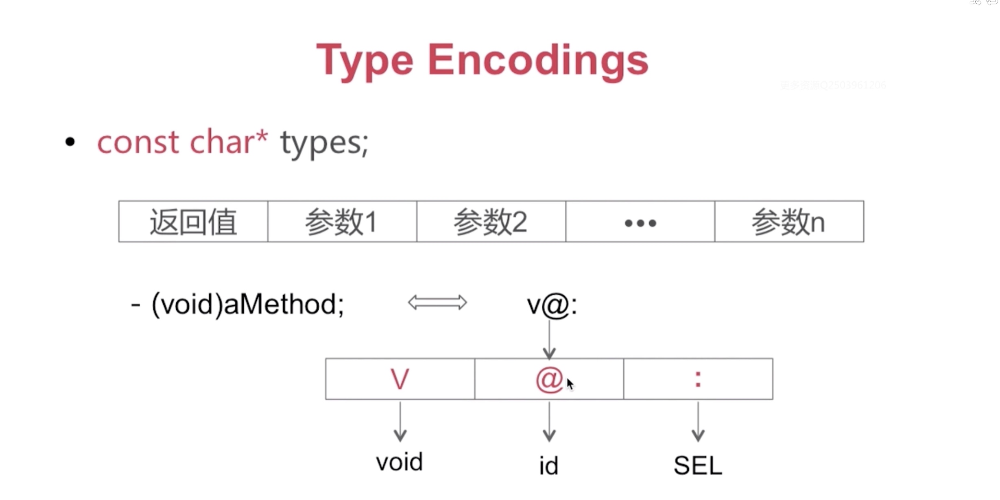

# Runtime 相关面试
## Runtime常见问题 - 数据结构


* objc_object:


* objc_class:


* isa指针:


* isa指针的指向:


* cache_t -- 方法缓存:


* class_data_bits_t:


* class_t的结构：


* class_ro_t:


* method_t:


Type_Encodings:



runtime的基础数据结构：


## Runtime常见问题 - 对象、类对象、元类对象


* 对象、类对象、元类对象的关系:


* 消息传递: -- 先是消息查找，查找不到才会走消息转发流程


## Runtime常见问题 -- 消息传递的具体流程
1. 缓存查找:
例子: 给定值是SEL,目标值是对应的bucket_t 中对应的IMP
 

2. 在当前类中查找


3.在父类中逐级查找: 


4.消息转发流程: 


## Runtime常见问题 -- 方法交换 Method Swizzling


* 动态方法添加:

```
// cls: 为哪个类添加方法
// name: 添加的Select名称
// imp:  自定义的IMP 实现
// types: typeEcoding 的值
class_addMethod(Class _Nullable cls, SEL _Nonnull name, IMP _Nonnull imp, const char * _Nullable types)

// 例如:class_addMethod(self, @selector(addMethod), addMethodImp, "v@:");
   
```

* 动态方法解析:

