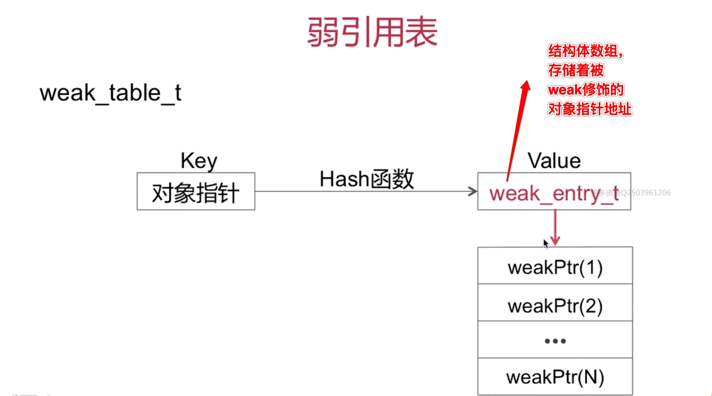

# 内存管理相关

## iOS 上的内存分配

stack:(栈区) 方法调用
heap:(堆区) 通过alloc等分配的对象
bss: 未初始化的全局变量
data: 已初始化的全局变量
text: 程序代码

#### 内存管理方案
1. TaggedPointer
2. NONPOINTER_ISA --非指针型内存管理方案
3. 散列表 --- 是一个复杂的数据结构，并且包括了引用计数表和弱引用表

#### NONPOINTER_ISA
在arm64架构下,64个bit位存储的内容如下:

 
 
####  散列表方式:
SideTables: 其实是一张hash表:
 

* SideTable的数据结构:

* 为什么不是一张SideTable,而是使用了多张SideTable?
因为一张表，并且牵扯到多线程安全问题，肯定是要加锁的，当要操作的对象个数较多的时候，存在效率问题

为了解决效率问题, 苹果使用了分离锁的解决方法，用来解决效率问题

* 分离锁如何快速分流?:

## 散列表实现内存管理

#### 散列表实现内存管理方式的数据结构
1. 自旋锁: Spinlock_t
2. 弱引用表: weak_table_t
3. 引用计数表: RefountMap

size_t的结构:

weak_table_t:

#### ARC
ARC: 是LVVM跟Runtime相互协作的结果
ARC中禁止调用MRC中独有的方法：比如retain/release/retainCount/dealloc
ARC 新增了weak/stron 属性关键字

#### 引用计数管理

alloc 实现:
经过一些列调用,最终调用了C函数calloc
此时并没有设置引用计数为1

#### Retain 实现

#### Release实现：

#### RetainCount实现:

#### dealloc的实现
* 对象释放判断机制:
只有当下面几个条件都为NO的时间才会释放:

## 弱引用管理

声明一个弱引用属性:
id __weak obj1 = obj; === 编译 ===> id obj1; objc_initWeak(&obj1,obj);

一个被 __weak 修饰的对象指针，经过编译器编译后会变成objc_initWeak，然后经过一些的函数调用栈，最后会在weak_register_no_lock()这个函数中进行弱引用的添加，具体添加的位置是通过一个hash算法进行查找的，若查找到的位置已经有了当前对象所对应的弱引用数组，那么就会把新的弱引用变量添加那个数组中去，如果没有，就创建一个新的弱引用数组，并将新的弱引用变量添加到第0个位置。

## 弱引用管理 -- 清楚weak变量,同时设置指向为nil

在走dealloc 后会经过一些列的调用，最后走到weak_clear_no_lock函数

## 自动释放池 

#### AutoreleasePool的实现原理是怎样的

 

#### autorelease的实现流程:

## 循环引用
#### 如何破除循环引用？
1. 避免产生循环引用
2. 在合适的时机手动断环
#### 破除循环引用的具体方案

#### 破除循环引用的解决示例:

