# Block相关面试问题
### 什么是Block?
Block是将函数及其执行上下文封装起来的对象！！！
### Block的本质
可以使用【`clang -rewrite-objc file.m`】查看编译之后的文件内容
可以使用【`clang -rewrite-objc -fobjc-arc file.m`】查看编译之后blocck 截获变量的文件内容
### Block截获变量
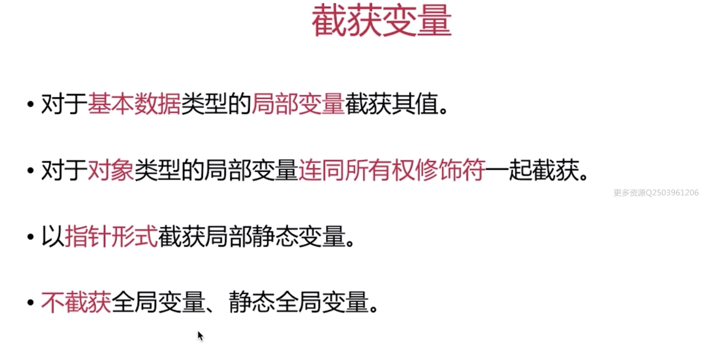

### __block 修饰符
一般情况下，对被捕获变量进行赋值操作的时候需要添加__block 修饰符(注意是被捕获变量赋值，而不是使用，仅仅是使用的时候不需要添加)

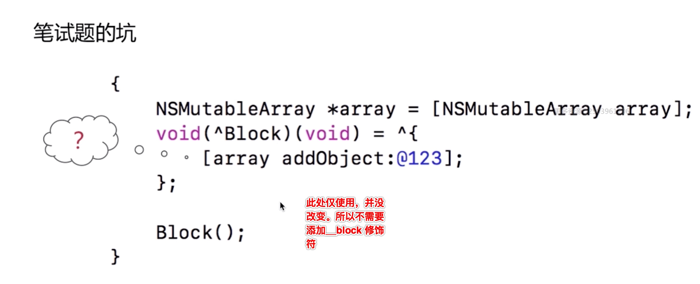
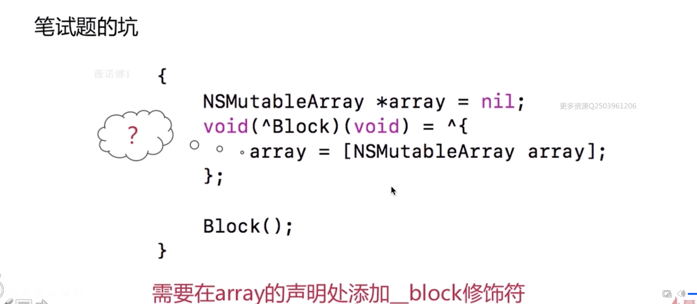

### 需要使用__block及不需要修饰符的情况
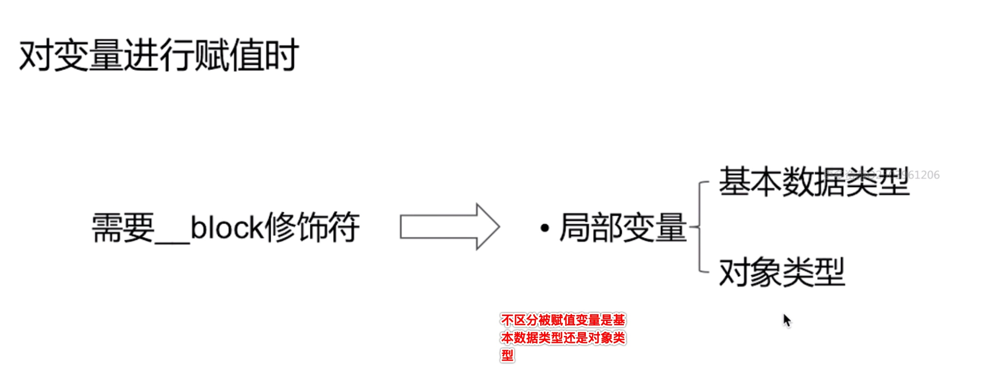
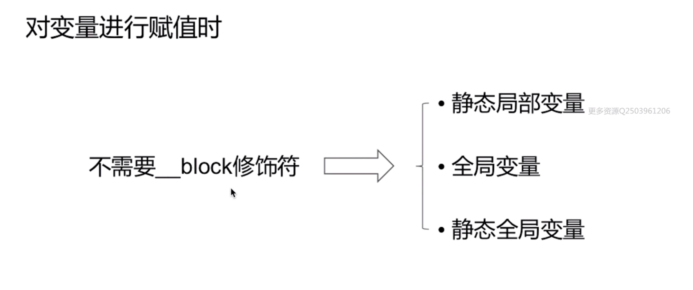

### 被__block 修饰符修饰变量的变化特点
__block 修饰符修饰的变亮会变成亮对象
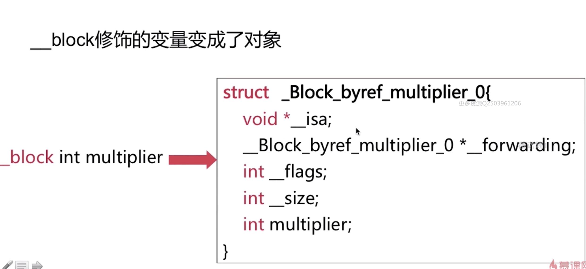

⚠️注意⚠️：在栈上的__forwarding指针是指向它自身的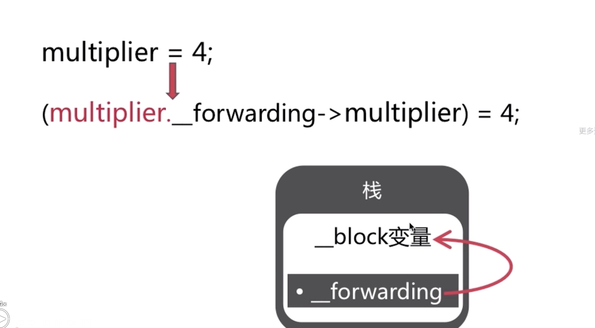

## Block的内存管理
### Block的类型
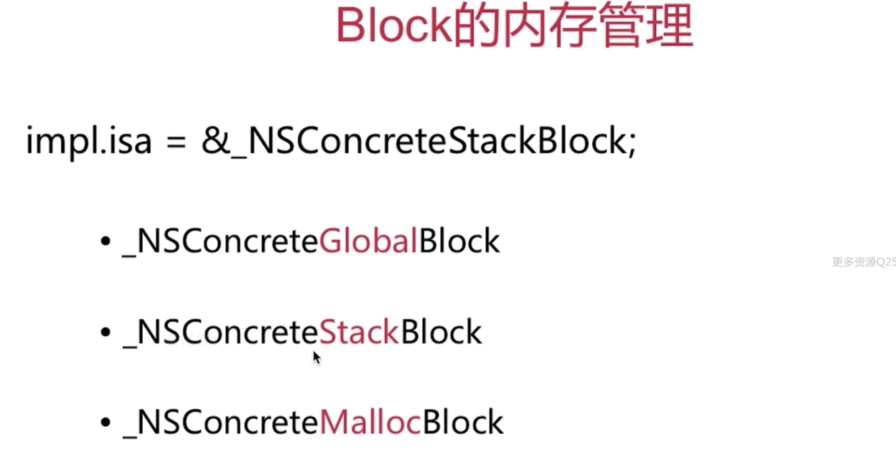
各种类型block的内存分布
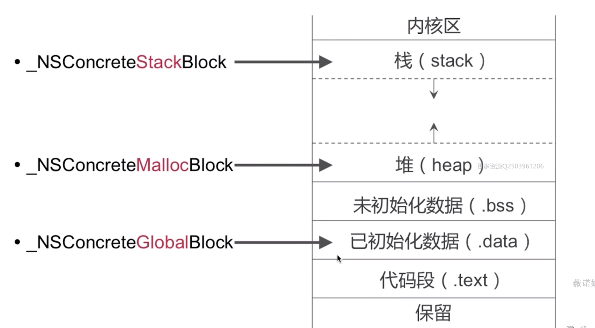

### 对不同类型block进行copy 操作的不同结果
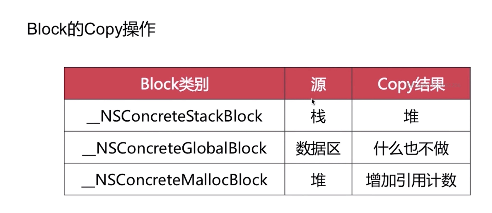

单纯的栈block ,会随着作作用域的结束而销毁
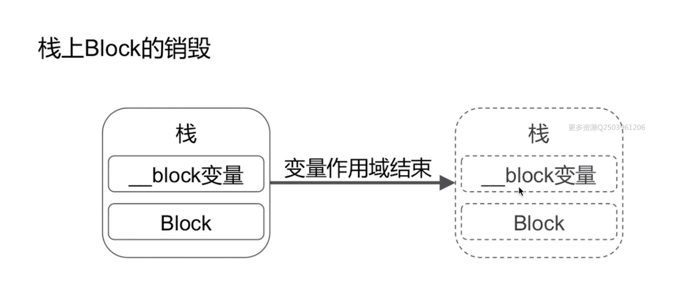
对栈上的block进行copy 操作
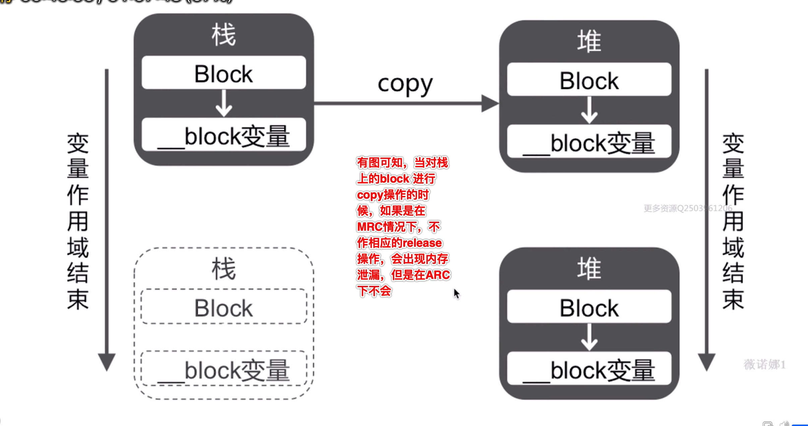

修改__block变量
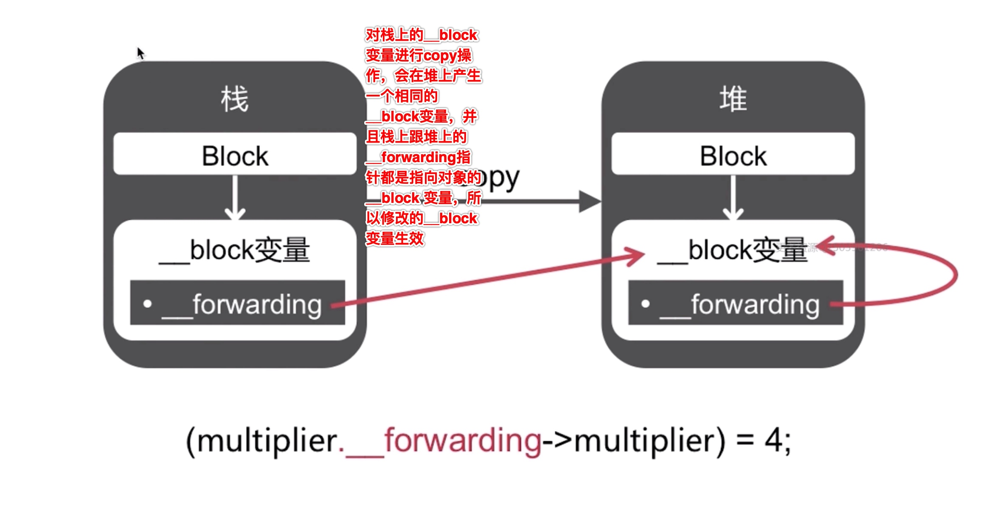

### __forwarding的总结
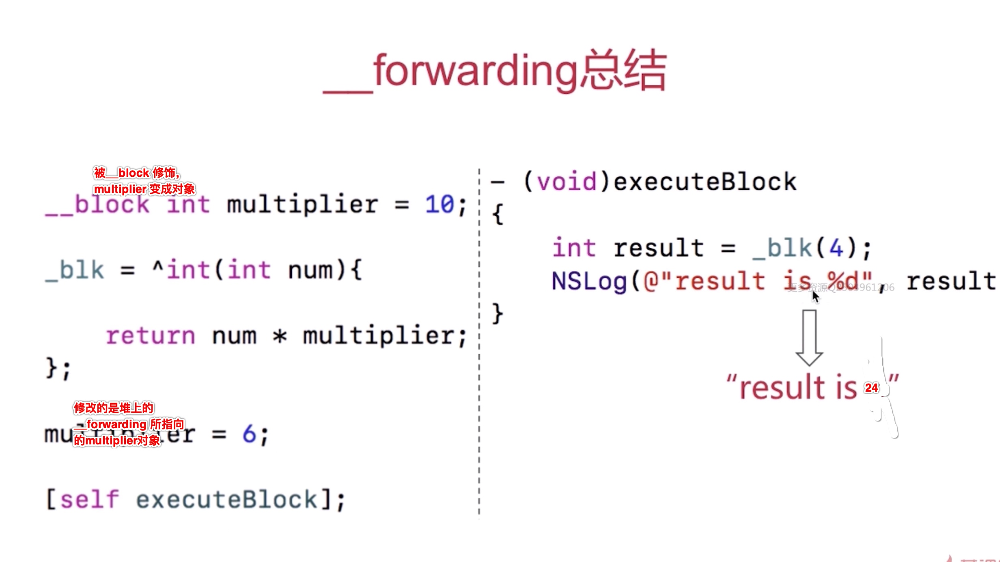

### __forwarding 存在的意义，就是无论在任何内存位置，都可以顺利的访问同一个__block 变量
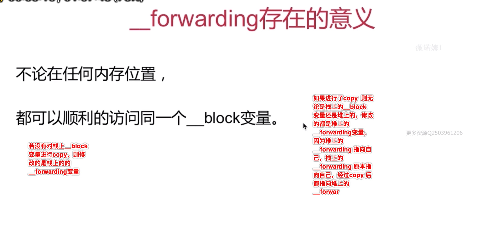

## Block 引起的循环引用

例子1:
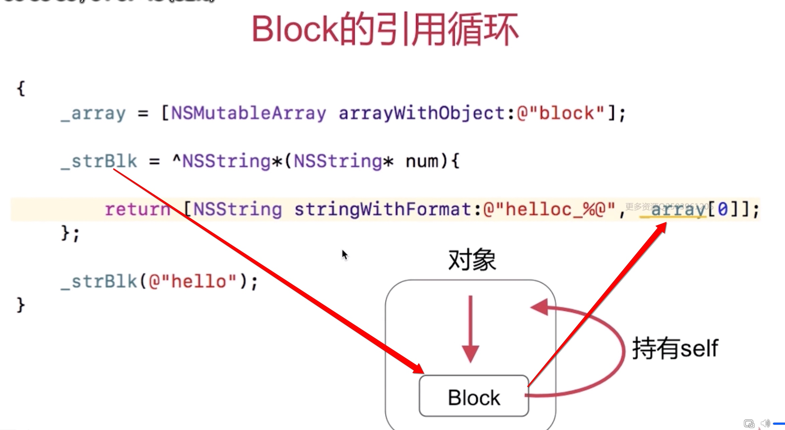

解决循环引用
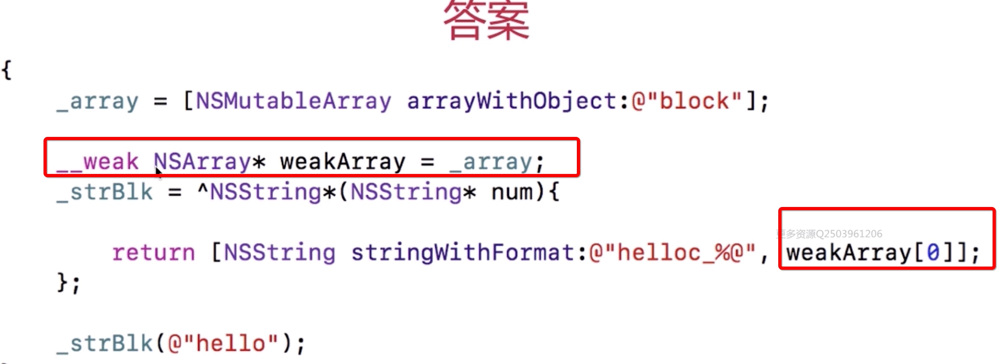

例子2:
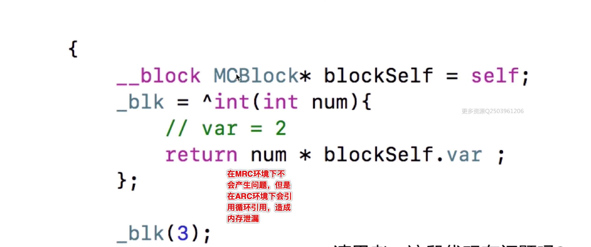
产生原因：
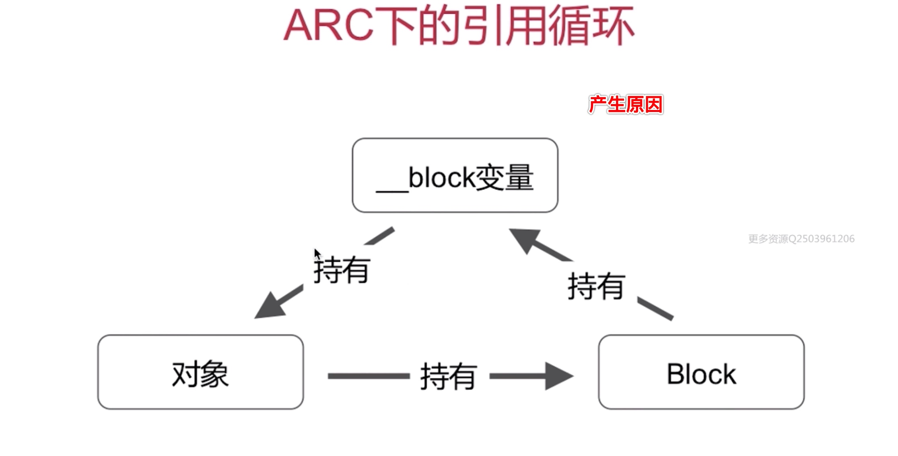

解决方法：
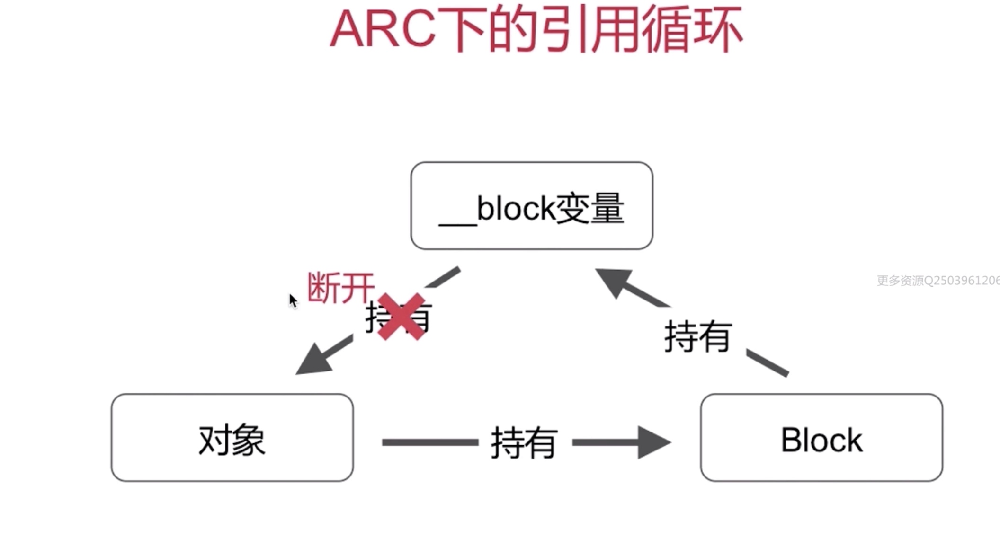
⚠️注意⚠️： 解决方案及弊端:
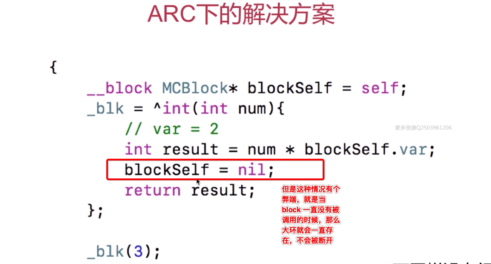
